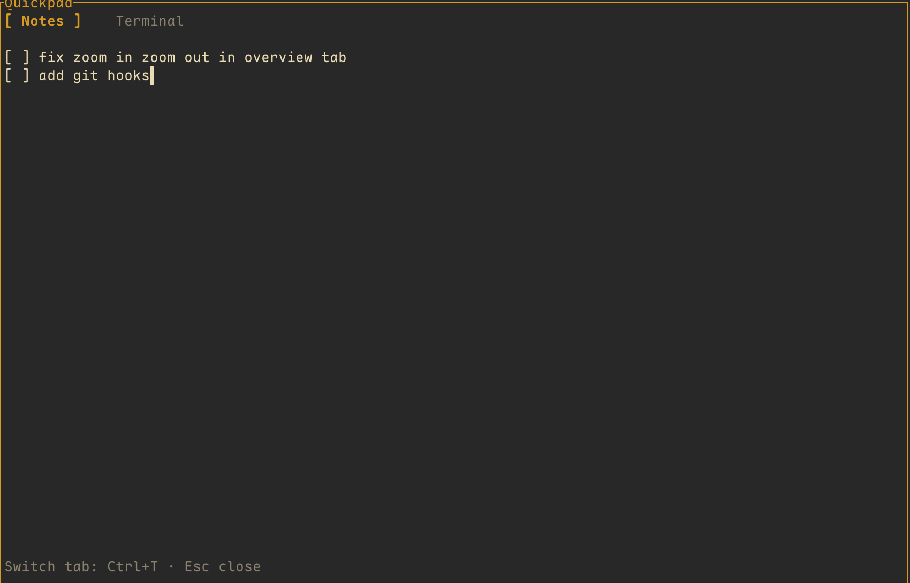
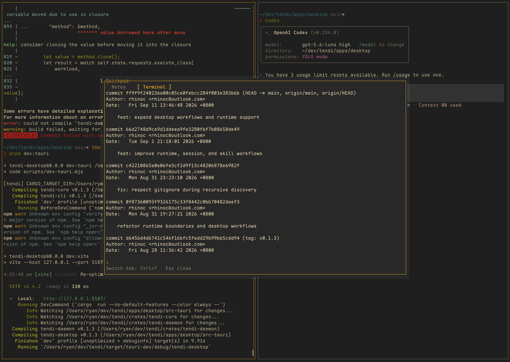

<div align="center">
  <br />
  <h1>Quickpad</h1>
  <p>A temporary Herdr workspace for quick notes, checklists, and one-time shell commands.</p>
  <br />
</div>

## Screenshots

<table>
  <tr>
    <td align="center">
      
      <br />
      <sub>Notes tab with an auto-saving checklist</sub>
    </td>
    <td align="center">
      
      <br />
      <sub>Terminal tab inside the same popup</sub>
    </td>
  </tr>
</table>

Quickpad is a Herdr plugin for temporary work. It opens a focused popup with two full-screen tabs:

- **Notes** for short-lived Markdown or plain-text notes
- **Terminal** for commands that are useful once and do not need a dedicated terminal window

## Features

- 📝 **Auto-saving Markdown notes** — Edit, split, and delete lines without a separate save action, with inline rendering for headings, emphasis, lists, and task checkboxes.
- 🖥️ **Embedded terminal** — Start a shell in the current popup, rooted at your home directory.
- 🔁 **Fast tab switching** — Click either tab or press `Ctrl+T` from either tab.
- 🧹 **Temporary by design** — `cmd+j` toggles the popup and `Esc` closes it.

## Requirements

- Herdr **0.9.0** or newer
- Node.js with native dependencies supported on macOS or Linux

## Install

Install the plugin from GitHub:

```bash
herdr plugin install rhinoc/herdr-quickpad
herdr plugin action list --plugin rhinoc.herdr-workbench
```

Add a global shortcut to `~/.config/herdr/config.toml`:

```toml
[[keys.command]]
key = "cmd+j"
type = "plugin_action"
command = "rhinoc.herdr-workbench.toggle"
description = "toggle quickpad"
```

Reload the configuration:

```bash
herdr config check
herdr server reload-config
```

## Usage

Open Quickpad with `cmd+j`.

### Notes

- Type normally; changes are saved automatically.
- `Enter` inserts a new line.
- Arrow keys move the cursor.
- `Delete` and `Backspace` remove text or join adjacent lines.
- Type Markdown directly; headings, emphasis, lists, code, and `- [ ]` task checkboxes render inline while the original Markdown is preserved.
- `Ctrl+T` switches to Terminal.

### Terminal

- The first switch starts one shell in the user home directory.
- Switching back and forth reuses the same shell session.
- `Ctrl+T` switches back to Notes.
- Shell input stays inside this popup; Quickpad does not open a separate Herdr tab.

### Keyboard shortcuts

| Shortcut | Action |
| --- | --- |
| `cmd+j` | Open or close Quickpad |
| `Ctrl+T` in either tab | Switch between Notes and Terminal |
| `Esc` | Close Quickpad |

The `Notes` and `Terminal` labels at the top are clickable from either tab.

## Data

Notes are stored in Herdr's plugin state directory. All Herdr spaces share the same global note.

## Development

Install dependencies and run the test suite:

```bash
npm install
npm test
```

The plugin entry point is `index.js`. The `toggle` command opens or closes Quickpad; the `ui` command runs the popup interface.
